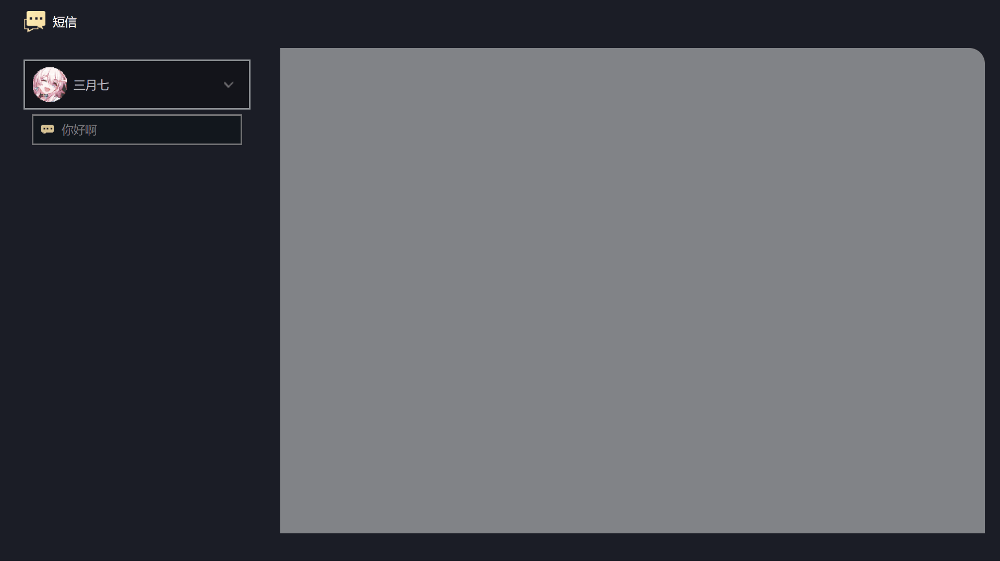
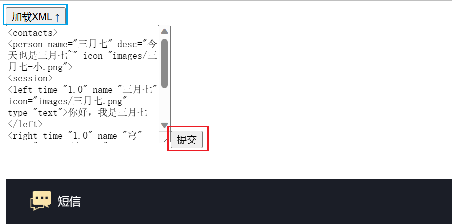
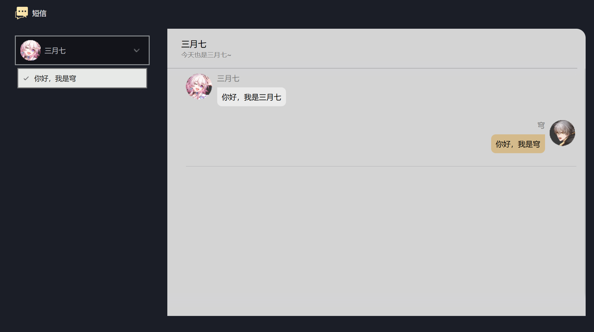
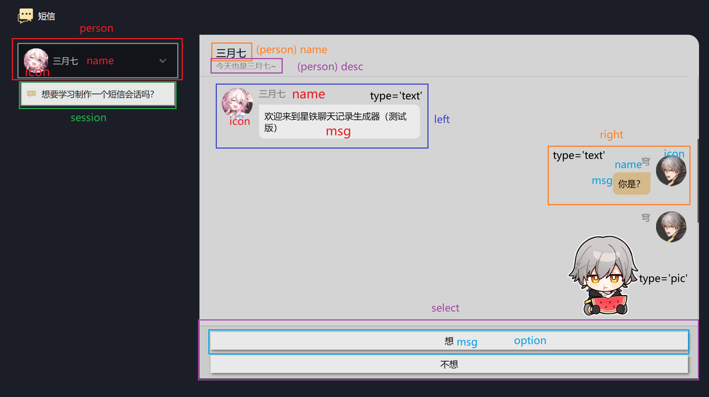

# Star Rail Message Maker

星穹铁道短信制作 / 浏览器   效果 ↓↓↓



## 尝试一下？

https://cubeww.github.io/star-rail-msg-maker/

## 开发工具

html+css+vue3+vscode

## 怎么做聊天？

聊天记录以**XML格式**存储，所以你需要编写**XML格式**的聊天记录文件。

首先你需要创建一个文本文件，并把后缀名改成.xml。然后就可以往里面填内容了。下面先给出一个简单的示例：

```xml
<contacts>
    <person name="三月七" desc="今天也是三月七~" icon="images/三月七-小.png">
        <session>
            <left time='1.0' name='三月七' icon='images/三月七.png' type='text'>你好呀</left>
            <left time='1.0' name='三月七' icon='images/三月七.png' type='pic' src='images/三月七-骄傲.gif'>[骄傲]</left>
            <left time='1.0' name='三月七' icon='images/三月七.png' type='text'>欢迎来到星铁聊天记录生成器（测试版）</left>

            <select type='text'>
                <option msg='你是谁'>
                    <right name='穹' icon='images/穹.png' type='text'>你是？</right>
                    <right name='穹' icon='images/穹.png' type='pic' src='images/穹-吃瓜.gif'>[吃瓜]</right>
                    <left time='1.0' name='三月七' icon='images/三月七.png' type='text'>我是这个网页的向导，三月七</left>
                </option>
                <option msg='这是啥'>
                    <right name='穹' icon='images/穹.png' type='text'>这是什么？</right>
                </option>
            </select>

            <left time='1.0' name='三月七' icon='images/三月七.png' type='text'>这个网页可以制作星穹铁道风格的聊天记录</left>
            <left time='1.0' name='三月七' icon='images/三月七.png' type='text'>就像你现在看见的一样</left>
            <left time='1.0' name='三月七' icon='images/三月七.png' type='text'>并且可以像游戏里那样交互哦</left>
            
            <left time='1.0' name='三月七' icon='images/三月七.png' type='text'>想要学习制作一个短信会话吗？</left>
            <select type='text'>
                <option msg='想'>
                    <right name='穹' icon='images/穹.png' type='text'>想啊，很想啊</right>

                    <left time='1.0' name='三月七' icon='images/三月七.png' type='text'>好嘞</left>
                    <left time='1.0' name='三月七' icon='images/三月七.png' type='text'>https://github.com/cubeww/star-rail-msg-maker/blob/master/README.md</left>
                    <left time='1.0' name='三月七' icon='images/三月七.png' type='text'>来看吧</left>
                </option>
                <option msg='不想'>
                    <right name='穹' icon='images/穹.png' type='text'>说的好，但是我不想</right>

                    <left time='1.0' name='三月七' icon='images/三月七.png' type='pic' src='images/三月七-哭.gif'>[哭]</left>
                    <left time='1.0' name='三月七' icon='images/三月七.png' type='text'>没关系</left>
                    <left time='1.0' name='三月七' icon='images/三月七.png' type='text'>等你想的时候可以随时来问我~</left>
                </option>
            </select>

        </session>
    </person>
</contacts>
```

这样一个简单的聊天就写好了。

要想显示聊天记录，只需点击网页顶部的“**加载XML**”，将写好的xml文本全部复制到“加载XML”下方的**文本框**里，最后点击“**提交**”即可。



效果如下：



------

那么各个标签都是什么含义呢？下面给出一张图方便大家理解：



- contacts：xml文档的根标签，里面可以包含多个person标签。
- person：联系人标签。里面可以包含多个session标签。
- session：聊天会话标签。里面可以包含多个left、right、select标签。
- left：**对方**消息标签。里面只可以写消息内容（文本或图片链接）。
- right：**我方**消息标签。里面只可以写消息内容（文本或图片链接）。
- select：**选择**消息标签。里面可以包含多个option标签。
- option：**选项**标签。和session标签类似，里面可以包含多个left、right、select标签，代表该选项触发的消息组。同时，option中也可以套娃select，达成更复杂的分支...